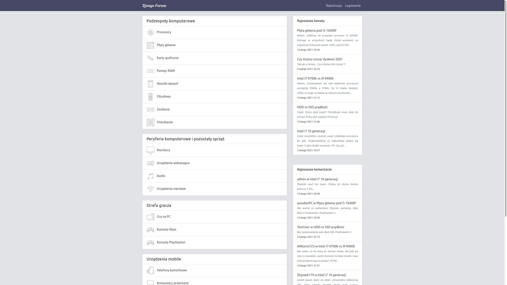
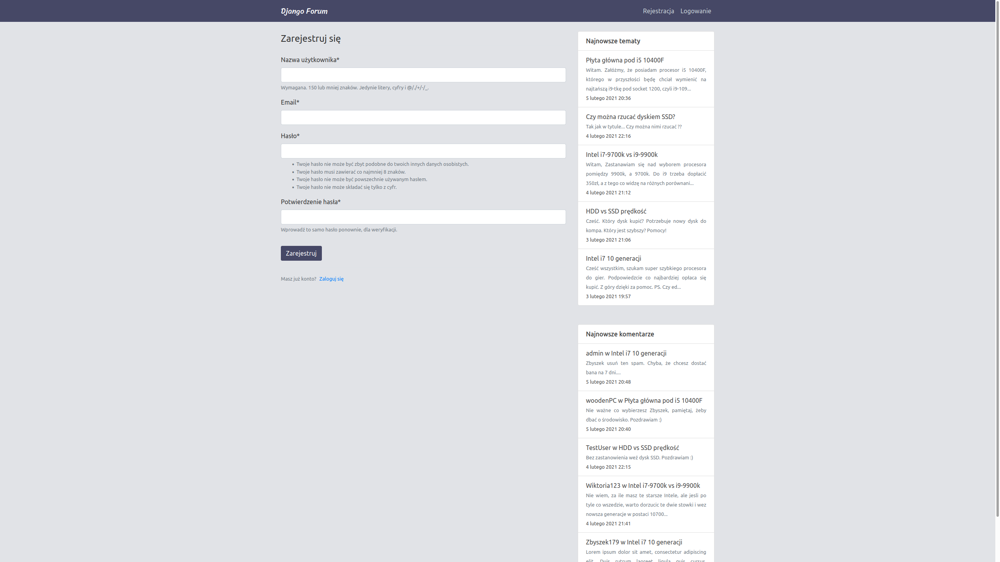
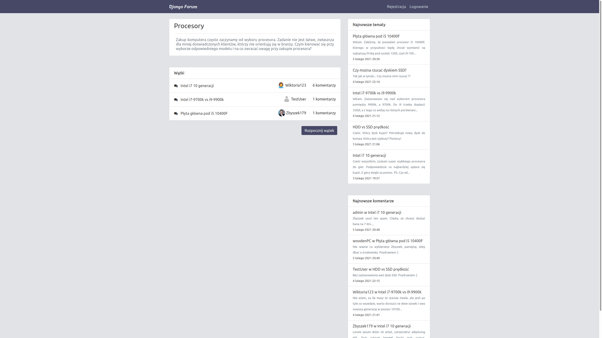
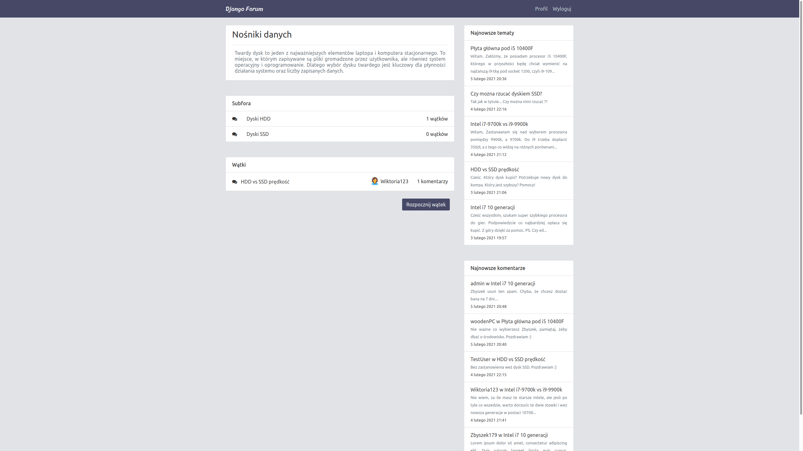
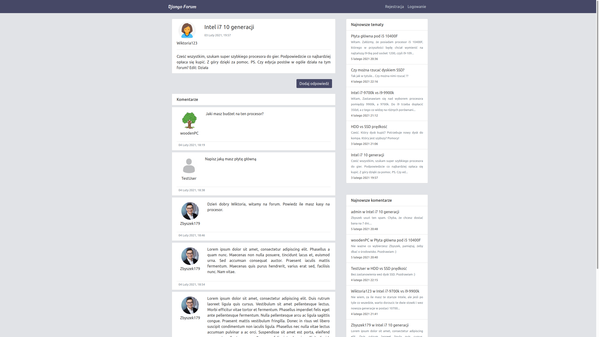

# DjangoForum #

Forum inspirowane https://forum.benchmark.pl/

## Instalacja ##

1. `python3 -m venv djangoForum_venv`
2. `source djangoForum_venv/bin/activate`
3. `cd django-forum-master`
4. `pip install django`
5. `pip install django-crispy-forms`
6. `pip install django-cleanup`
7. `pip install pillow`
8. `python3 manage.py runserver`

Forum dostępne pod adresem http://127.0.0.1:8000

## Screeny ##

